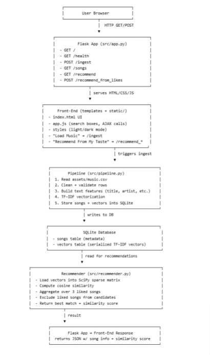

# Performative Music Recommender (TESTING)

## 1) Executive Summary

**Problem.** Recently the trend of the performative male has arisen and to a certain extent everyone is performative. However, among the stereotype of performative male's many can look the part but find it hard to discover or even listen to the music associated with the stereotype as my dear friend JM encountered. JM knew a couple songs but wanted to expand his music taste and discover songs that are *both* genuinely similar and still on-brand for the performative male stereotype.

**Solution.** The **Performative Music Recommender** is a small web app and API that ingests a curated CSV of ~250 on-brand songs, builds a vector-based similarity model, and then recommends one “performatively similar” track based on three songs the user selects. The whole system is packaged in a Docker container with a one-command run, and served through a Flask backend plus a lightweight HTML/JS front-end with dark mode and searchable dropdowns.

---

## 2) System Overview

### Course Concepts

* **Data pipelines** – ingesting a CSV of songs into a SQLite DB and generating a sparse vector matrix used for recommendations.
* **Flask API** – Rest endpoints for ingesting data, querying songs, health checks, and generating recommendations.
* **Containerization with Docker** – reproducible build and one-command run on a clean machine.
* **Structure** – HTML UI with a python back end pulling from an assets.csv along with a requirements.txt.

### Architecture Overview & Project Structure




The project structure is as follows:
```bash
PerformativeMusicRecommender/
│
├── assets/
│   └── music.csv                 # My sample dataset of performative music
│
├── src/
│   ├── __init__.py
│   ├── app.py                    # Main Flask application 
│   ├── config.py                 # App settings 
│   ├── db.py                     # SQLite database logic
│   ├── pipeline.py               # Ingest pipeline (reads CSV → DB)
│   └── recommender.py            # Embeddings + Cosine similarity logic
│
├── static/
│   └── app.js                    # Frontend JS (searchable dropdowns, dark mode)
│
├── templates/
│   └── index.html                # Frontend UI (dark/light theme, dropdown search)
│
├── tests/
│   ├── test_health.py            # Basic health endpoint test
│   └── test_reccomend.py         # Recommend logic test
│
├── .env                          # Local environment variables (NOT committed)
├── .env.example                  # Template env file for others
├── Dockerfile                    # Docker build for local development
├── requirements.txt              # Python dependencies
├── run.sh                        # Convenience script to run locally
├── README.md                     # Project documentation
└── LICENSE                       # License for the project (Using MIT license as a sample)
```

### Data / Models / Services

* **Data source:** Curated CSV via 10 friend's opinion on performative music (`assets/music.csv`)
* **Fields:** `item_id, title, artist, album, genre, tags, description`
* **Size:** 250 rows, 7 columns, <100 KB.
* **Model:** simple TF-IDF-style vectorization + cosine similarity (no external ML model), it essentially converts song meta data to vectors and compares the vectors by picking the most similar ones.
* **Services:** single Flask service running in a Docker container.

## 3) How to Run (Local with Docker)

### Prerequisites

* Docker installed (e.g., Docker Desktop).
* Repo cloned locally.
* Optional: copy `.env.example` → `.env` and adjust any config variables if needed.

### Build

```bash
docker build -t performative-music-recommender:latest .
```

### Run

```bash
docker run --rm -p 9999:8080 --env-file .env performative-music-recommender:latest
```

* App UI: [http://localhost:9999/](http://localhost:9999/)
* Health check:

```bash
curl http://localhost:8080/health
```

### Usage Flow

1. Open `http://localhost:9999/`.
2. Click **“Load Music!”** to call `POST /ingest` and load the CSV into SQLite + build vectors.
3. In each of the 3 search boxes:
   * Start typing an **artist or title** (e.g., “Laufey”, “Big Thief”, "Clairo").
   * Pick from the dropdown (`Artist — Title`).
4. Click **“Recommend From My Taste”**.
5. See a result card with:

   * Artist — Title
   * Album, genre, tags, description
   * Similarity score.

---

## 4) Design Decisions

### Why this concept?

* I wanted something fun and personal that still exercised **data pipelines**, **Flask APIs**, and **Docker containerization**, which are core course concepts. A music recommender is easy to interact with and provides visible feedback that the pipeline and model are working. My friend JM struggle's to find performative music making it a meaningful project & also an early birthday gift.

### Alternatives Considered

* **Static Jupyter notebook** instead of a web UI:

  * Rejected because it doesn’t practice API design or containerized deployment, and would probably make for a bad birthday gift.
* **Heavier model (e.g., sentence embeddings or a remote LLM API):**

  * Rejected to keep the project self-contained, deterministic, and fast to run inside the container. It was hard to make it similar to performative music without external data.
* **Remote DB (Postgres/Mongo):**

  * SQLite is sufficient for a small catalog and keeps setup simple.

### Tradeoffs

* **Simplicity vs. sophistication:**
  A TF-IDF-like cosine model is simple and explainable, but less powerful than modern embedding models. It’s enough to demonstrate the concept, and put it into use.
* **Single service vs. microservices:**
  Everything runs in one containerized Flask app, which limits scalability but simplifies deployment and testing.
* **Rescaled similarity scores:**
  I rescaled the cosine similarity for display so “good” matches look more intuitive to users, while keeping the raw cosine score available in the API response. This made it easier for JM to interpret the results and find music he liked.

### Security / Privacy

* No user accounts; no PII is stored.
* Secrets (if any) are intended to live in `.env`, not in source code.
* API validates inputs:

  * `/recommend_from_likes` requires a list of exactly 3 integers.
  * Rejects duplicates so users must pick three distinct songs.
  * Recommendation explicitly excludes the liked song IDs from user.

### Ops / Limitations

* Logging uses Python’s standard `logging` module.
* No metrics/monitoring system yet, but the architecture supports adding them.
* Known limitations:

  * Small dataset.
  * No persistence for user histories or feedback.

---

## 5) Results & Evaluation

### Sample Output 


### Functionality

* End-to-end workflow works:

  * Ingest CSV → SQLite + vectors.
  * Front-end loads full song list via `/songs`.
  * Users pick three distinct songs with search-enabled dropdowns.
  * `/recommend_from_likes` returns a recommendation that is **not** one of the input songs.
* The UI includes:

  * Dark/light mode toggle.
  * Clear validation messages (e.g., “Please choose 3 different songs,” “No songs in our database, click Load Music,” etc.).
  * Artist-first labels (`Artist — Title`) to make selection more natural. (Thanks JM for the suggestion!)

### Testing / Validation

* Manual smoke tests:

  * Health check (`/health`).
  * Ingest path (`/ingest`) from a clean DB.
  * Recommendation behavior for:

    * Valid 3-song input.
    * Duplicate IDs (correctly rejected).
    * IDs outside the dataset (ignored).
* Container tested on a clean environment to ensure:

  * `docker build` succeeds.
  * `docker run` exposes the app on the expected port.

### Performance / Footprint

* Dataset is tiny; in-memory vectors are small.
* Inference (cosine similarity over ~250 songs) is effectively instantaneous on a laptop.
* Container image is based on `python:3.11-slim` to reduce size.

---

## 6) What’s Next

Planned and stretch improvements:

* **Better recommender**

  * Use pretrained text or audio embeddings instead of just TF-IDF.
  * Support multiple recommendation strategies (e.g., diversity vs. closeness).
* **Richer UX**

  * Show a top-5 recommendation list instead of 1.
  * Add links to streaming services for each track.
  * Let users “like/dislike” recommendations and retrain or re-rank.
* **Ops & Observability**

  * Add structured logging and simple metrics (request counts, errors).
  * CI workflow to run tests and build the Docker image on each push.
* **Cloud deployment**

  * Deploy to a public cloud (e.g., Azure, Render, or Railway) with a stable URL.

---

## 7) Links (Required)

* **GitHub Repo:** `<https://github.com/SJ-Jain-systems/DS2022_FinalProject_PerformativeMusicReccomender>`
